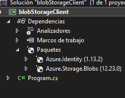
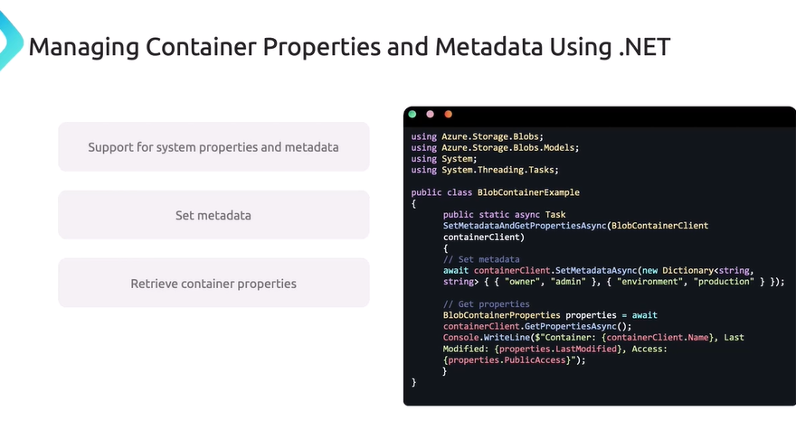
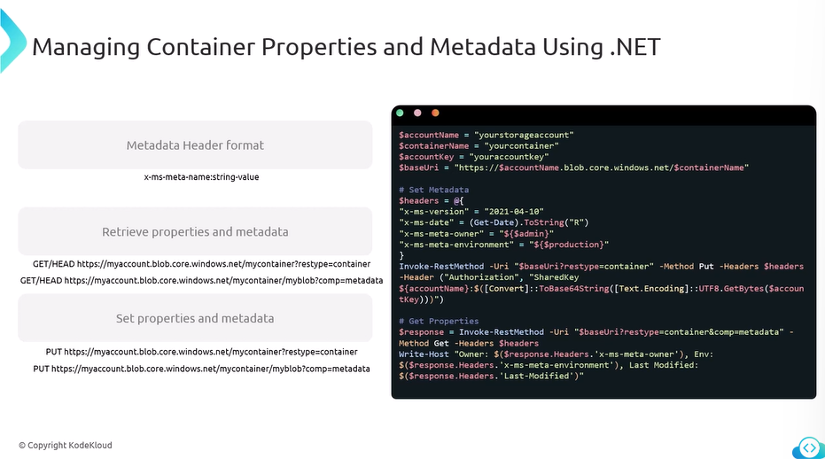
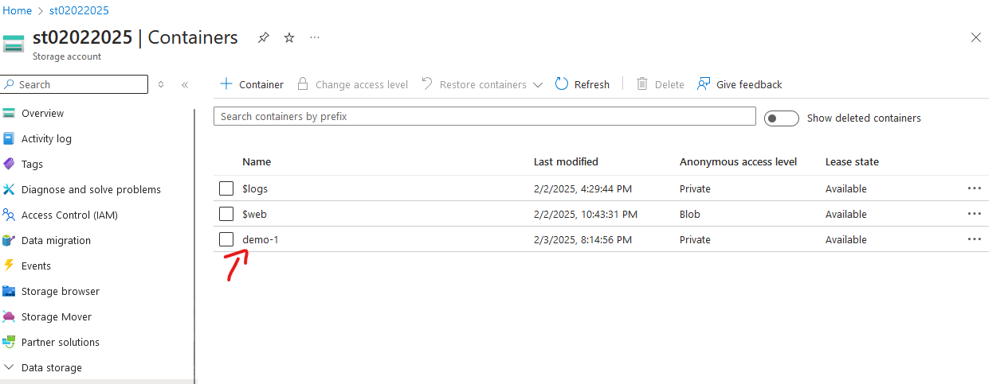
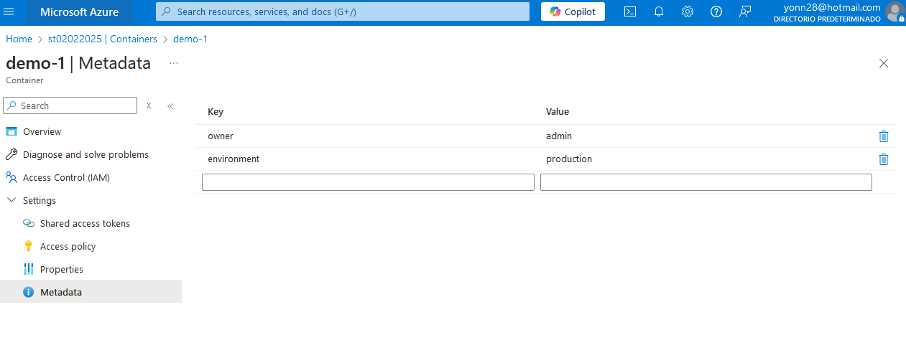
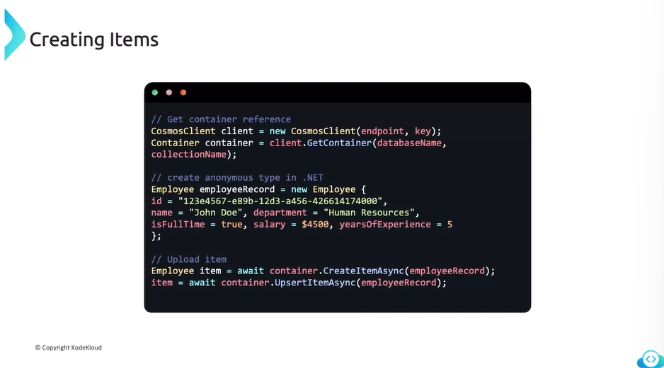

codigo para listar los contenedores de azure en c#

instalar dependencias

`
using Azure.Identity;
using Azure.Storage.Blobs;
using System;
using System.ComponentModel;
using System.Threading.Tasks;

class Program
{
    static async Task Main(string[] args)
    {
        string endpoint = "https://st02022025-secondary.blob.core.windows.net/";
        var credential = new DefaultAzureCredential();
        BlobServiceClient blobServiceClient = new BlobServiceClient(new Uri(endpoint), credential);
        var endpointUri = blobServiceClient.Uri;
        Console.WriteLine("Connnected to "+ endpointUri);

        await ListContainersInAccount(blobServiceClient);

    }

    static async Task ListContainersInAccount(BlobServiceClient blobServiceClient) 
    {
        Console.WriteLine("listing container info ....");
        await foreach (var container in blobServiceClient.GetBlobContainersAsync()) {
            Console.WriteLine($"Container: {container.Name}");
        }
    }
}
`

modificar container properties .net

modificar container properties powershell

`
using Azure.Storage.Blobs;
using Azure.Storage.Blobs.Models;
using System;
using System.Collections.Generic;
using System.Threading.Tasks;

class Program
{
    static async Task Main(string[] args)
    {
        string connectionString = "connection str";
        string containerName = "demo-1";
        BlobServiceClient blobServiceClient = new BlobServiceClient(connectionString);
        BlobContainerClient containerClient = blobServiceClient.GetBlobContainerClient(containerName);
        await containerClient.CreateIfNotExistsAsync();

        var metadata = new Dictionary<string, string>
        {
            { "owner", "admin" },
            { "environment", "production" }
        };

        await containerClient.SetMetadataAsync(metadata);
        Console.WriteLine("Metadata has been set successfully.");

 
        BlobContainerProperties properties = await containerClient.GetPropertiesAsync();
        Console.WriteLine("Container Metadata:");
        foreach (var kvp in properties.Metadata)
        {
            Console.WriteLine($"{kvp.Key}: {kvp.Value}");
        }
    }
}

`

crear contenendor 

y adicionar metadata al contenedor

subir desde azcopy la data del sitio estatico usando azcopy

`
./azcopy copy "C:\Users\ynova\Desktop\az204-kodekloud\AZ-204\Storage Account - Static Website\*" '<storage_account_sas_token>' --recursive=true
`

cosmos DB create item in .net

herramienta de migracion de datos (AzureCosmosDB/data-migration-desktop-tool)

https://learn.microsoft.com/es-es/azure/cosmos-db/how-to-migrate-desktop-tool?tabs=azure-cli

https://github.com/AzureCosmosDB/data-migration-desktop-tool?tab=readme-ov-file#tutorial-json-to-cosmos-db-migration

ejemplo de configuracion de la herramienta tener encuenta el filepath no esta como en formato windows, tambien es mejor pegarlo en el mismo directorio para que funcione. airports.json fue usado.

`
{
  "Source": "json",
  "Sink": "cosmos-nosql",
  "SourceSettings": {
    "FilePath": "airports.json"
  },
  "SinkSettings": {
    "ConnectionString": "AccountEndpoint=....",
    "Database": "flightDetails",
    "Container": "airportCodes",
    "PartitionKeyPath": "/id",
    "RecreateContainer": true,
    "WriteMode": "Insert",
    "CreatedContainerMaxThroughput": 5000,
    "IsServerlessAccount": false
  }
}

`
el formato debe ser algo como un array de json con el attributo id. tambien tener en cuenta las RU's si son muy bajas no sube.
`
[
    {
       "id":"00AK",
       "icao":"00AK",
       "iata":"",
       "name":"Lowell Field",
       "city":"Anchor Point",
       "state":"Alaska",
       "country":"US",
       "elevation":450,
       "lat":59.94919968,
       "lon":-151.695999146,
       "tz":"America/Anchorage"
    },
    {
        .....
    }
]
`