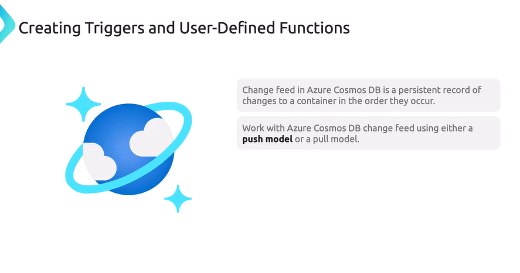

codigo para listar los contenedores de azure en c#

instalar dependencias


```
using Azure.Identity;
using Azure.Storage.Blobs;
using System;
using System.ComponentModel;
using System.Threading.Tasks;


class Program
{
    static async Task Main(string[] args)
    {
        string endpoint = "https://st02022025-secondary.blob.core.windows.net/";
        var credential = new DefaultAzureCredential();
        BlobServiceClient blobServiceClient = new BlobServiceClient(new Uri(endpoint), credential);
        var endpointUri = blobServiceClient.Uri;
        Console.WriteLine("Connnected to "+ endpointUri);

        await ListContainersInAccount(blobServiceClient);

    }

    static async Task ListContainersInAccount(BlobServiceClient blobServiceClient) 
    {
        Console.WriteLine("listing container info ....");
        await foreach (var container in blobServiceClient.GetBlobContainersAsync()) {
            Console.WriteLine($"Container: {container.Name}");
        }
    }
}
```


modificar container properties .net


modificar container properties powershell


```
using Azure.Storage.Blobs;
using Azure.Storage.Blobs.Models;
using System;
using System.Collections.Generic;
using System.Threading.Tasks;

class Program
{
    static async Task Main(string[] args)
    {
        string connectionString = "connection str";
        string containerName = "demo-1";
        BlobServiceClient blobServiceClient = new BlobServiceClient(connectionString);
        BlobContainerClient containerClient = blobServiceClient.GetBlobContainerClient(containerName);
        await containerClient.CreateIfNotExistsAsync();

        var metadata = new Dictionary<string, string>
        {
            { "owner", "admin" },
            { "environment", "production" }
        };

        await containerClient.SetMetadataAsync(metadata);
        Console.WriteLine("Metadata has been set successfully.");

 
        BlobContainerProperties properties = await containerClient.GetPropertiesAsync();
        Console.WriteLine("Container Metadata:");
        foreach (var kvp in properties.Metadata)
        {
            Console.WriteLine($"{kvp.Key}: {kvp.Value}");
        }
    }
}

```

crear contenendor 


y adicionar metadata al contenedor


subir la data del sitio estatico usando azcopy, el container por defecto es $web y lo detecta como variable así que para el storage account sas_token usar comilla sencilla para que no trate de reemplazar como variable de powershell o escapar en caso de linux.

```
./azcopy copy <localizacion_archivos> <storage_account_sas_token> --recursive=true
```

cosmos DB create item in .net


herramienta de migracion de datos (AzureCosmosDB/data-migration-desktop-tool)


https://learn.microsoft.com/es-es/azure/cosmos-db/how-to-migrate-desktop-tool?tabs=azure-cli

https://github.com/AzureCosmosDB/data-migration-desktop-tool?tab=readme-ov-file#tutorial-json-to-cosmos-db-migration


ejemplo de configuracion del archivo 'migrationsettings.json' tener encuenta el filepath no esta como en formato windows, tambien es mejor pegarlo en el mismo directorio para que funcione. airports.json fue usado.


```
{
  "Source": "json",
  "Sink": "cosmos-nosql",
  "SourceSettings": {
    "FilePath": "airports.json"
  },
  "SinkSettings": {
    "ConnectionString": "AccountEndpoint=....",
    "Database": "flightDetails",
    "Container": "airportCodes",
    "PartitionKeyPath": "/id",
    "RecreateContainer": true,
    "WriteMode": "Insert",
    "CreatedContainerMaxThroughput": 5000,
    "IsServerlessAccount": false
  }
}

```
el formato debe ser algo como un array de json con el attributo id. tambien tener en cuenta las RU's (request units, se configuran a la creacion de la cuenta de cosmos)  si son muy bajas no sube.
```
[
    {
       "id":"00AK",
       "icao":"00AK",
       "iata":"",
       "name":"Lowell Field",
       "city":"Anchor Point",
       "state":"Alaska",
       "country":"US",
       "elevation":450,
       "lat":59.94919968,
       "lon":-151.695999146,
       "tz":"America/Anchorage"
    },
    {
        .....
    }
]
```

validacion de carga de datos en cosmosDB


crreeacion de un item nuevo en cosmos


colocar el endpoint y la key


storage procedures


trieggers and user-defined functions


```
function pretrigger(){
    var item = getContext().getRequest().getBody();
    if(!item.country_code){
        item.country_code="unidentified";
    }

    item.timestamp = new Date().toISOString();

    getContext().getRequest().setBody(item)
}
```


tambien existen los pretriggers


change feed in azure cosmos





