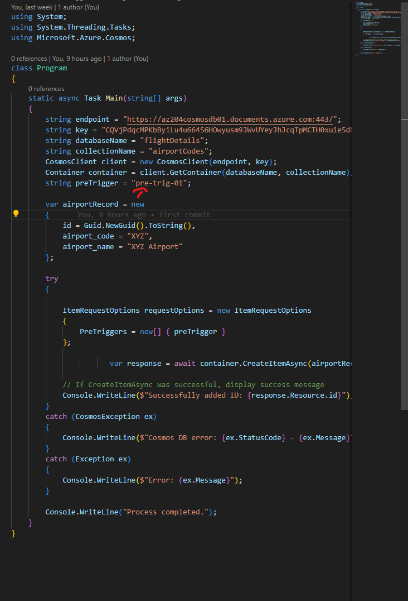
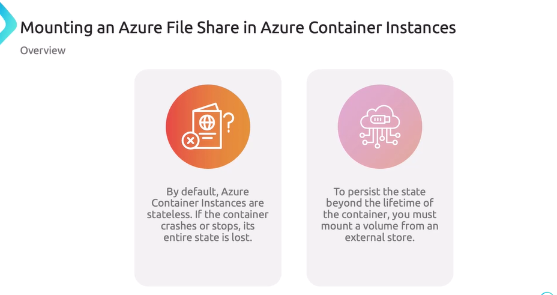
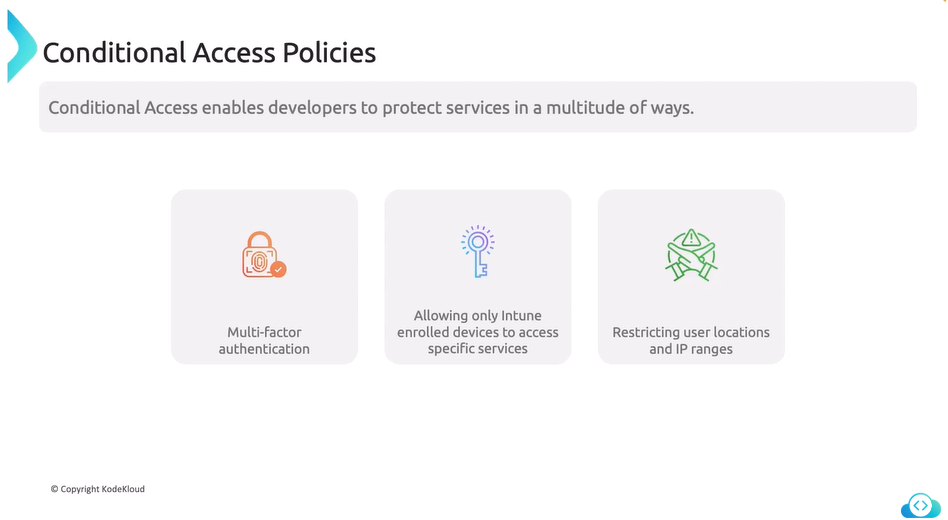
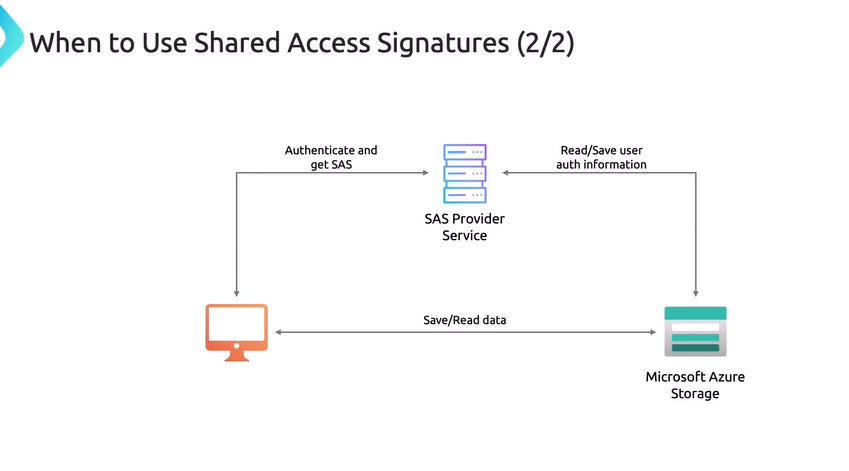

# codigo para listar los contenedores de azure en c#

instalar dependencias


```
using Azure.Identity;
using Azure.Storage.Blobs;
using System;
using System.ComponentModel;
using System.Threading.Tasks;


class Program
{
    static async Task Main(string[] args)
    {
        string endpoint = "https://st02022025-secondary.blob.core.windows.net/";
        var credential = new DefaultAzureCredential();
        BlobServiceClient blobServiceClient = new BlobServiceClient(new Uri(endpoint), credential);
        var endpointUri = blobServiceClient.Uri;
        Console.WriteLine("Connnected to "+ endpointUri);

        await ListContainersInAccount(blobServiceClient);

    }

    static async Task ListContainersInAccount(BlobServiceClient blobServiceClient) 
    {
        Console.WriteLine("listing container info ....");
        await foreach (var container in blobServiceClient.GetBlobContainersAsync()) {
            Console.WriteLine($"Container: {container.Name}");
        }
    }
}
```


modificar container properties .net


modificar container properties powershell


```
using Azure.Storage.Blobs;
using Azure.Storage.Blobs.Models;
using System;
using System.Collections.Generic;
using System.Threading.Tasks;

class Program
{
    static async Task Main(string[] args)
    {
        string connectionString = "connection str";
        string containerName = "demo-1";
        BlobServiceClient blobServiceClient = new BlobServiceClient(connectionString);
        BlobContainerClient containerClient = blobServiceClient.GetBlobContainerClient(containerName);
        await containerClient.CreateIfNotExistsAsync();

        var metadata = new Dictionary<string, string>
        {
            { "owner", "admin" },
            { "environment", "production" }
        };

        await containerClient.SetMetadataAsync(metadata);
        Console.WriteLine("Metadata has been set successfully.");

 
        BlobContainerProperties properties = await containerClient.GetPropertiesAsync();
        Console.WriteLine("Container Metadata:");
        foreach (var kvp in properties.Metadata)
        {
            Console.WriteLine($"{kvp.Key}: {kvp.Value}");
        }
    }
}

```

crear contenendor 


y adicionar metadata al contenedor


subir la data del sitio estatico usando azcopy, el container por defecto es $web y lo detecta como variable así que para el storage account sas_token usar comilla sencilla para que no trate de reemplazar como variable de powershell o escapar en caso de linux.

```
./azcopy copy <localizacion_archivos> <storage_account_sas_token> --recursive=true
```
---
# cosmos DB create item in .net


herramienta de migracion de datos (AzureCosmosDB/data-migration-desktop-tool)


https://learn.microsoft.com/es-es/azure/cosmos-db/how-to-migrate-desktop-tool?tabs=azure-cli

https://github.com/AzureCosmosDB/data-migration-desktop-tool?tab=readme-ov-file#tutorial-json-to-cosmos-db-migration


ejemplo de configuracion del archivo 'migrationsettings.json' tener encuenta el filepath no esta como en formato windows, tambien es mejor pegarlo en el mismo directorio para que funcione. airports.json fue usado.


```
{
  "Source": "json",
  "Sink": "cosmos-nosql",
  "SourceSettings": {
    "FilePath": "airports.json"
  },
  "SinkSettings": {
    "ConnectionString": "AccountEndpoint=....",
    "Database": "flightDetails",
    "Container": "airportCodes",
    "PartitionKeyPath": "/id",
    "RecreateContainer": true,
    "WriteMode": "Insert",
    "CreatedContainerMaxThroughput": 5000,
    "IsServerlessAccount": false
  }
}

```
el formato debe ser algo como un array de json con el attributo id. tambien tener en cuenta las RU's (request units, se configuran a la creacion de la cuenta de cosmos)  si son muy bajas no sube.
```
[
    {
       "id":"00AK",
       "icao":"00AK",
       "iata":"",
       "name":"Lowell Field",
       "city":"Anchor Point",
       "state":"Alaska",
       "country":"US",
       "elevation":450,
       "lat":59.94919968,
       "lon":-151.695999146,
       "tz":"America/Anchorage"
    },
    {
        .....
    }
]
```

validacion de carga de datos en cosmosDB


crreeacion de un item nuevo en cosmos


colocar el endpoint y la key


storage procedures


## trieggers and user-defined functions


```
function pretrigger(){
    var item = getContext().getRequest().getBody();
    if(!item.country_code){
        item.country_code="unidentified";
    }

    item.timestamp = new Date().toISOString();

    getContext().getRequest().setBody(item)
}
```





tambien existen los pretriggers


change feed in azure cosmos: la idea es ejecutar codigo con cambios en algun documento o item en la bd.


# Azure container registries

```
dotnet --list-runtimes
mkdir App
cd App/
dotnet new webapp -n MyNewWebApp
cd MyNewWebApp/
dotnet restore MyNewWebApp.csproj 
```

```
cd MyNewWebApp/
cd Pages/
vi Index.cshtml
cat Index.cshtml
cd ../..
vi Dockerfile
```

```
FROM mcr.microsoft.com/dotnet/aspnet:8.0 AS base
WORKDIR /app
EXPOSE 80

FROM mcr.microsoft.com/dotnet/sdk:8.0 AS build
WORKDIR /src
COPY ["MyNewWebApp/MyNewWebApp.csproj", "MyNewWebApp/"]
RUN dotnet restore "MyNewWebApp/MyNewWebApp.csproj"
COPY . .
WORKDIR "/src/MyNewWebApp"
RUN dotnet build "MyNewWebApp.csproj" -c Release -o /app/build

FROM build AS publish
RUN dotnet publish "MyNewWebApp.csproj" -c Release -o /app/publish

FROM base AS final
WORKDIR /app
COPY --from=publish /app/publish .
ENTRYPOINT ["dotnet", "MyNewWebApp.dll"]
```

```
az acr build -r acr204052025 -g rg-registries -t webapp:v1 .

az acr buld -r <registry_name> -g <resource_group> -t <contaniername:TAG> <directory>
```

---
# azure container instances


azure container instances


azure container instances restart policies y variables de entorno


variables de entorno


para la configuaracion de container instance los datos se pueden tomar el contaner registry en la seccion de keys


un ejemplo de comando a usar, para crear una container instance junto con una imagen por defecto se muestra a continuacion

```
az container create -g rg-container-instance -n ac1-01 \
  --image acr204052025.azurecr.io/webapp:v1 \
  --registry-login-server acr204052025.azurecr.io \
  --registry-username acr204052025 \
  --registry-password 'xxxx' \
  --ports 8080 \
  --ip-address Public \
  --os-type Linux \
  --cpu 1 \
  --memory 2.0
```


montar file share en container instance




para utilizar un file share utilizar el siguiente archivo yaml tomado de https://learn.microsoft.com/en-us/azure/container-instances/container-instances-volume-azure-files,

importante cambiar la imagen, y el dnslabel con una valor aleatorio.

```
apiVersion: '2019-12-01'
location: eastus
name: file-share-demo
properties:
  containers:
  - name: hellofiles
    properties:
      environmentVariables: []
      image: mcr.microsoft.com/azuredocs/aci-hellofiles
      ports:
      - port: 80
      resources:
        requests:
          cpu: 1.0
          memoryInGB: 1.5
      volumeMounts:
      - mountPath: /aci/logs/
        name: filesharevolume
  osType: Linux
  restartPolicy: Always
  ipAddress:
    type: Public
    ports:
      - port: 80
    dnsNameLabel: aci-demo
  volumes:
  - name: filesharevolume
    azureFile:
      sharename: acishare
      storageAccountName: <Storage account name>
      storageAccountKey: <Storage account key>
tags: {}
type: Microsoft.ContainerInstance/containerGroups
```

desplegar usando este comando


```
az container create --resource-group myResourceGroup --file deploy-aci.yaml
```
---
# Azure container apps


push the container


create resource group

```
az group create --location westus --resource-group rgcontainerapp01
```
create enviroment container app

```
 az containerapp env create --name myEnvironment --resource-group rgcontainerapp01   --location westus 
```

create the container app

```
az containerapp create --name ariportsapi --resource-group rgcontainerapp01 --image acr204052025.azurecr.io/webapp02:v1 --cpu 0.5 --memory 1Gi --environment myEnvironment --ingress 'external' --target-port 8080 --registry-server acr204052025.azurecr.io --registry-username acr204052025 --registry-password 'xxx'

```

testing that api


authentication authorization


despues de las configuraciones anteriores se puede acceder a la api, pero se debe autenticar.

## managing revision and secrets

esta parte es parecido a los deployments slots de las webapp, se puede tener un biding para bases de datos o storages accounts, tambien se puede colocar porcentaje de redireccionamiento de trafico.


los secretos se manejan en esta pestaña


dapr integration


What is the purpose of the Distributed Application Runtime (Dapr) integration in Azure Container Apps? -> To provide a programming model for microservices


---
# Microsoft identity Platform


creacion de un secret en el app registation, para poder autenticar, ya la grantizacion de que el sp tenga accesos,


generacion de token auth para autenticacion service principal


```
curl --location 'https://login.microsoftonline.com/4066ac16-42bc-4a44-bb29-a0e8fbf7fbeb/oauth2/v2.0/token' \
--header 'Content-Type: application/x-www-form-urlencoded' \
--header 'Cookie: fpc=AuV0L1SA7kFIg0-TJSsGUdwf5Y4PAQAAAMzFNt8OAAAA; stsservicecookie=estsfd; x-ms-gateway-slice=estsfd' \
--data-urlencode 'client_id=ca99dcbc-a432-4dd8-ad63-492c1e61dd2a' \
--data-urlencode 'client_secret=xxx' \
--data-urlencode 'grant_type=client_credentials' \
--data-urlencode 'scope=https://graph.microsoft.com/.default'
```


request para obtener los usuarios del tenant, el ejemplo de solicitud se saco de la pagina de microsoft https://developer.microsoft.com/en-us/graph/graph-explorer


se presentan error por falta de permisos, modificarlos en el app registrations


cambiando los niveles de accesos, a user read all en api permissions, y creando un token nuevo se logra la respuesta


se puede validar el token de sesion desde la pagina de decodificacion de microsoft https://jwt.ms/


conditional access




---

# MSAL (microsoft autentication library)


whit debbuging 


```
using System;
using System.Threading.Tasks;
using Microsoft.Identity.Client;

class Program
{
    private static string tenantId = "";    
    private static string clientId = "";    
    private static string clientSecret = "";  
    private static string[] scopes = { "https://graph.microsoft.com/.default" }; 

    static async Task Main(string[] args)
    {
              IConfidentialClientApplication app = ConfidentialClientApplicationBuilder.Create(clientId)
            .WithClientSecret(clientSecret)
            .WithAuthority(new Uri($"https://login.microsoftonline.com/{tenantId}"))
            .Build();

        try
        {
          
            var result = await app.AcquireTokenForClient(scopes)
                                  .ExecuteAsync();

 
            Console.WriteLine("Access Token:");
            Console.WriteLine(result.AccessToken);
        }
        catch (MsalServiceException ex)
        {
            // Handle the exception
            Console.WriteLine($"Error acquiring token: {ex.Message}");
        }
    }
}
```

creacion de service principal powershell
```
az ad sp create-for-rbac
```

---

# shared access signatures (sas)


arquitecturas de obtener sas tocken




## Stored Access Policies


---

# microsoft graph


habilitar en el service principal de public client flows


# Azure Key vault


# Managed identities


# App Configuration Service

configuracion del applicaciones sin necesidad de redesplegar.


generacion de connection string


generacion de valores en la App configuration


despues de iniciado el proyecto no nececita refrescar auto actualiza los cambios solo es conectarse al servicio.


---

Api Management

adicionar scm a el dominio, el domino incluye la zona


